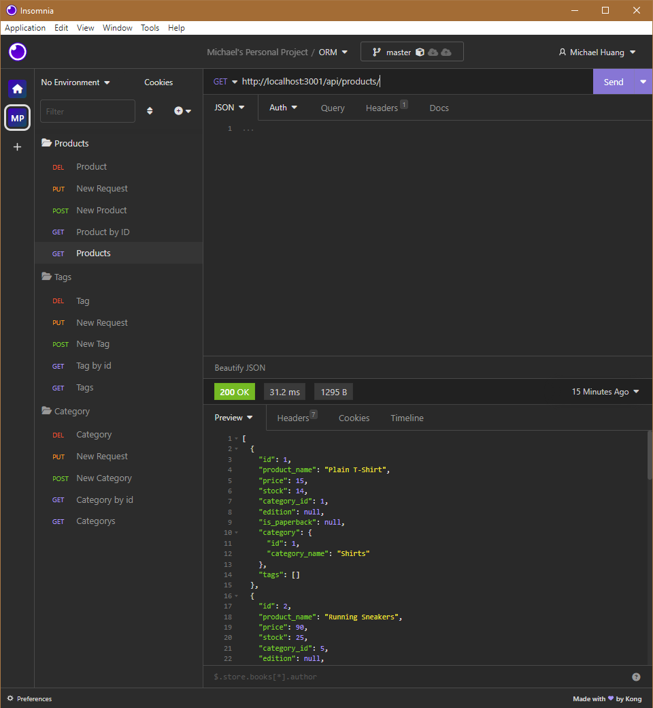

# ORM-a-ments

  ## Description

  This ORM-a-ments was created for boot camp students who were going through Module 13. It contains the backend to an E-Commerce application and can host different requests from the user.

  ## Table of Contents

  * [Installation](#installation)
  * [Usage](#usage)
  * [License](#license)
  * [Screenshots](#screenshots)
  * [Tests](#tests)
  * [Contributing](#contributing)
  * [Questions](#questions)


  ## Installation

  ```npm i```

  Will also need the "INSOMNIA" application to store route requests and then test them after the server has been started

  ## Usage

  To use this app, operate in the command terminal and run ```node server.js```. Follow the screencastify video for a walkthrough.

  ## License

  [](https://opensource.org/licenses/MIT)

  [License](#license)

  This project is licensed under the MIT license.

  ## Screenshots

  [screencastify](https://drive.google.com/file/d/1n6rtyIxn7xxfOwga70NyGUjE8i1dXTan/view)

  

  ## Tests

  The walkthrough video demonstrates how to use the "INSOMNIA" app with server link.

  ```http://localhost:3001/api/```

  ## Questions

  Github Profile: [seafoodude](https://github.com/seafoodude)
  Email: [seafoodude@gmail.com](seafoodude@gmail.com)

  ## Contributing

  Special thanks to Emma, Big Mike, Patricia, Bryan, and Shawn for guiding me through this experience!
